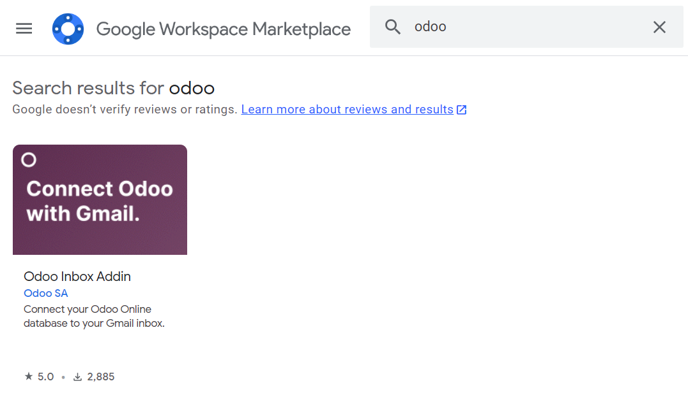
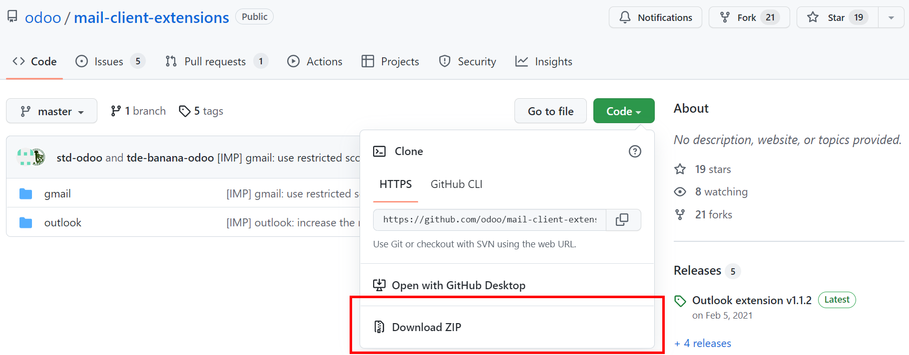

============
Gmail Plugin
============

The Gmail Plugin integrates your Odoo database with your Gmail inbox.

For Odoo Online users
=====================

For databases hosted on Odoo Online (or Odoo.sh), follow the steps below to configure the Gmail 
Plugin.

Install the Gmail Plugin
------------------------

First, make sure you are logged in to the Gmail account that you wish to connect with Odoo.

From your Gmail inbox, click the plus sign (“+”) on the right sidebar to get add-ons. Use the
search bar to search for “Odoo” and locate the :guilabel:`Odoo Inbox Addin`. Or, go directly to
the :guilabel:`Odoo Inbox Addin` page on `Google Workspace Marketplace
<https://workspace.google.com/marketplace/app/odoo_inbox_addin/873497133275>`_.

Click :guilabel:`Install`, then click :guilabel:`Continue` to start installing the plugin. 

Select which Gmail account you wish to connect with Odoo, then click :guilabel:`Allow` to let
Odoo access your Google account. Google will then show a pop-up window confirming that the
installation was successful.

Configure your Odoo database
----------------------------

The :guilabel:`Mail Plugin` feature must be enabled in your Odoo database in order to use the Gmail
Plugin. Go to :menuselection:`Settings --> General Settings`. Under :guilabel:`Integrations`,
activate :guilabel:`Mail Plugin`, and then click :guilabel:`Save`.

.. image:: gmail/mail-plugin-setting.png
   :align: center
   :alt: Mail Plugin feature in Settings

Configure your Gmail inbox
--------------------------

In your Gmail inbox, a purple Odoo icon will now appear on the right sidebar. Click on the Odoo
icon to open up the Odoo plugin window. Then, click on any email in your inbox. Click
:guilabel:`Authorize Access` in the plugin window to grant Odoo access to your Gmail inbox.

.. image:: gmail/authorize-access.png
   :align: center
   :alt: Authorize Access button in the right sidebar of the Odoo plugin panel

Next, click :guilabel:`Login`. Enter the URL of the Odoo database that you wish to connect with
your Gmail inbox, and log in to the database.

.. note::
   Use the general URL for the database, not the URL of a specific page in the database. For example, use `https://stealthywood.odoo.com`, not `https://stealthywood.odoo.com/web#cids=1&action=menu`.

Then, click :guilabel:`Allow` to let Gmail access your Odoo database. The browser will then show a
“Success!” message. Close the window. Your Gmail inbox and Odoo database are now connected.

For on-premise users
====================

For databases hosted on servers other than Odoo Online (or Odoo.sh), follow the steps below to
configure the Gmail Plugin.

.. note::
   As part of their security guidelines, Google Workspace Marketplace requires add-on creators to
   provide a list of URLs that can be used in actions (and redirections) launched by the add-on.
   This protects users by ensuring, for example, that no add-on redirects users toward a malicious
   website. (Read more on `Google Apps Script
   <https://developers.google.com/apps-script/manifest/allowlist-url>`_.)
   
   Since Odoo could only list the odoo.com domain, and not every on-premise customer’s
   unique server domain, on-premise customers cannot install the Gmail Plugin from Google Workspace
   Marketplace.

Install the Gmail Plugin
------------------------

First, access the `GitHub repository <https://github.com/odoo/mail-client-extensions>`_ for the
Odoo Mail Plugins. Click on the green :guilabel:`Code` button, then click :guilabel:`Download ZIP`
to download the Mail Plugin files onto your computer.

Open the ZIP file on your computer. Then, go to :menuselection:`mail-client-extensions-master --> gmail --> src --> views`, and open the :guilabel:`login` TS file using any text editor software (e.g. Notepad (Windows), TextEdit (Mac), or Visual Studio Code).

Delete the following three lines of text from the :guilabel:`login` TS file:

.. code-block:: python

   if (!/^https:\/\/([^\/?]*\.)?odoo\.com(\/|$)/.test(validatedUrl)) {
        return notify("The URL must be a subdomain of odoo.com");
   }

This removes the odoo.com domain constraint from the Gmail Plugin program.

Next, in the ZIP file, go to :menuselection:`mail-client-extensions-master --> gmail`, and open the
file called :guilabel:`README`. Follow the instructions in the :guilabel:`README` file to push the
Gmail Plugin files as a Google Project.

.. note::
   Your computer must be able to run Linux commands in order to follow the instructions on the :guilabel:`README` file.

Share the Google Project with the Gmail account that you wish to connect with Odoo. Then click
:guilabel:`Publish` and :guilabel:`Deploy from manifest`. Lastly, click
:guilabel:`Install the add-on` to install the Gmail Plugin.

Configure your Odoo database
----------------------------

The :guilabel:`Mail Plugin` feature must be enabled in your Odoo database in order to use the Gmail
Plugin. Go to :menuselection:`Settings --> General Settings`. Under :guilabel:`Integrations`,
activate :guilabel:`Mail Plugin`, and then click :guilabel:`Save`.

.. image:: gmail/mail-plugin-setting.png
   :align: center
   :alt: Mail Plugin feature in Settings

Configure your Gmail inbox
--------------------------

In your Gmail inbox, a purple Odoo icon will now appear on the right sidebar. Click on the Odoo
icon to open up the Odoo plugin window. Then, click on any email in your inbox. Click
:guilabel:`Authorize Access` in the plugin window to grant Odoo access to your Gmail inbox.

.. image:: gmail/authorize-access.png
   :align: center
   :alt: Authorize Access button in the right sidebar of the Odoo plugin panel

Next, click :guilabel:`Login`. Enter the URL of the Odoo database that you wish to connect with
your Gmail inbox, and log in to the database.

.. note::
   Use the general URL for the database, not the URL of a specific page in the database. For example, use `https://stealthywood.odoo.com`, not `https://stealthywood.odoo.com/web#cids=1&action=menu`.

Then, click :guilabel:`Allow` to let Gmail access your Odoo database. The browser will then show a
“Success!” message. Close the window. Your Gmail inbox and Odoo database are now connected.